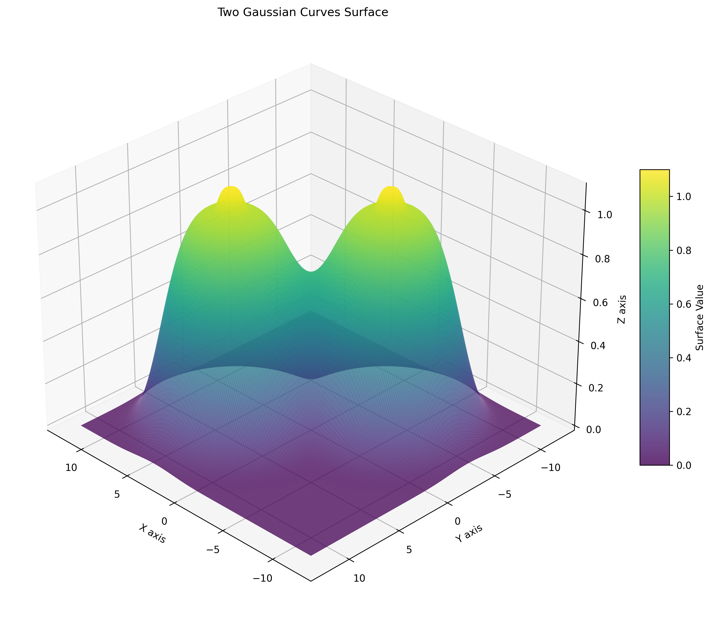
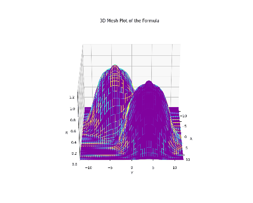

# Two Gaussian Curves Surface Visualization

A Python project that visualizes a complex mathematical surface composed of two Gaussian-like curves using 3D plotting with matplotlib.

<p align="center">
  
  <br/>
  <em>Two curvy gauss functions</em>
</p>

## Mathematical Formula

The surface is defined by the formula:
```
r = 1*exp^(-((x+4)² + (y+4)²)²/1000) + 1*exp^(-((x-4)² + (y-4)²)²/1000)
  + 0.1*exp^(-((x+4)² + (y+4)²)²/1) + 0.1*exp^(-((x-4)² + (y-4)²)²/1)
```

This creates two prominent peaks centered at (-4,-4) and (4,4) with additional smaller peaks at the same locations.

<p align="center">
  
  <br/>
  <em>Two curvy gauss functions</em>
</p>

## Features

- **High-resolution 3D surface plotting** with smooth shading
- **Multiple viewing angles** (front, side, elevated, rear views)
- **Animated GIF generation** with 360° rotation and color cycling
- **Optimized versions** for both quality and speed
- **Multiple light sources** for enhanced 3D visualization

## Files

### Core Scripts
- `static_plot.py` - Generates high-quality static images
- `multi_view_static.py` - Creates multiple static views from different angles
- `fast_gif.py` - Generates fast low-resolution animated GIF
- `gaussian_surface_plot.py` - Full-featured animation script

### Generated Outputs
- Various PNG images showing different views
- Animated GIFs with rotating perspectives
- High and low-resolution versions available

## Requirements

- Python 3.7+
- numpy
- matplotlib
- pillow (for GIF generation)

## Installation

1. Clone the repository:
```bash
git clone <your-repo-url>
cd grok_two_gauss_curves
```

2. Create virtual environment:
```bash
python -m venv .venv
```

3. Activate virtual environment:
```bash
# Windows
.venv\Scripts\activate

# Linux/Mac
source .venv/bin/activate
```

4. Install dependencies:
```bash
pip install numpy matplotlib pillow
```

## Usage

### Generate Static Images
```bash
python static_plot.py
```
Creates high-quality static images of the surface.

### Generate Multiple Views
```bash
python multi_view_static.py
```
Creates multiple static images from different viewing angles.

### Generate Fast Animation
```bash
python fast_gif.py
```
Creates a low-resolution animated GIF for quick preview.

### Generate Full Animation
```bash
python gaussian_surface_plot.py
```
Creates a high-quality animated GIF with color cycling (slower).

## Output Files

The scripts generate various image files:
- `gaussian_surface.png` - Basic static view
- `gaussian_surface_high_quality.png` - High-resolution static view
- `gaussian_surface_front_view.png` - Front perspective
- `gaussian_surface_side_view_90deg_rotated.png` - 90° rotated side view
- `gaussian_surface_elevated_front.png` - Elevated front view
- `gaussian_surface_rear_view.png` - Rear view
- `fast_gaussian_animation.gif` - Fast low-resolution animation
- `gaussian_surface_animation.gif` - High-quality animation

## Technical Details

- **Meshgrid**: Uses numpy's meshgrid with configurable resolution
- **Rendering**: matplotlib 3D plotting with surface shading
- **Animation**: FuncAnimation with customizable frame rates
- **Lighting**: Multiple light sources for enhanced depth perception
- **Color**: Viridis colormap with optional color cycling in animations

## Performance Notes

- High-resolution versions use smaller step sizes (0.02-0.05) for smooth surfaces
- Low-resolution versions use larger step sizes (0.3) for faster generation
- Animation frame count can be adjusted for speed vs. smoothness tradeoff

<p align="center">
  
  <br/>
  <em>Two curvy gauss functions</em>
</p>

## License

This project is open source. Feel free to use and modify as needed.